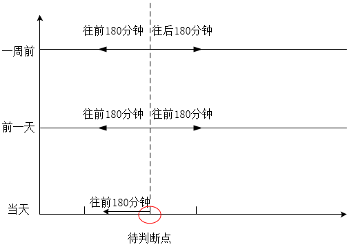

# API接口文档
## 时间序列异常检测学件接口

用户可使用API接口对时间序列进行异常检测，检测后的结果通过WEB管理端查看和管理。 服务端提供两个异常检测的API接口供不同场景调用：

1、量值检测：适用于大多数类型数据的检测，使用无监督和有监督联合检测，会加载检测模型

2、率值检测：适用于正态分布类型数据的检测，使用无监督算法进行检测，如成功率等生死指标数据的检测

- API请求调用请使用搭建的后端服务地址
- 当前检测时间窗口选取为3小时，每分钟1个数据点，即窗口值为180
- 同比数据日期和时间段的选择可根据实际情况调整，文档中两个同比数据分别取昨日和一周前的同比

针对当前一个值的检测，需要依赖过去三段数据，数据选取规则参考示例图：


### 1、HTTP接口

#### 1、量值检测

* API： POST /{ip}:{port}/PredictValue
* 功能说明：根据参考数据检测最近一个数据点是否异常
* 请求参数request：
	
```
{
    "viewId":"2012",
    "viewName":"登陆功能",
    "attrId":"19201",
    "attrName":"ptlogin登陆请求总量",
    "taskId":"1530608070706",
    "window":180,
    "time":"2018-10-17 17:28:00",
    "dataC":"9,10,152,...,255,...,16",
    "dataB":"9,10,152,...,255,...,18",
    "dataA":"9,10,152,...,458"
}
```

* request字段说明：

| 名称  | 类型 |必填| 默认值 | 说明 |
| --- | --- | --- |---- | --- |
| viewId| string| 是|无|指标集ID |
| viewName|  string| 是| 无|指标集名称|
| attrId|  string| 是| 无|指标ID|
| attrName|  string| 是| 无|指标名称|
| taskId|  string| 否| 无|使用的检测模型，如不传，则采用系统默认模型|
| window|  int| 是| 无|窗口值，目前支持180|
| time|  string| 是| 无|待检测点的时间标识，即dataA的最后一个点，格式："yyyy-MM-dd HH:mm:ss"|
| dataC|  string| 是| 无|待检测的1个点对应一周前同时刻的点 + 前后各180个数据，361个数据点按时间顺序拼接，英文逗号分隔|
| dataB|  string| 是| 无|待检测的1个点对应昨日同时刻的点 + 前后各180个数据，361个数据点按时间顺序拼接，英文逗号分隔|
| dataA|  string| 是| 无|待检测的1个点+前180个数据，共181个数据点，181个数据点按时间顺序拼接，英文逗号分隔|


* 详情参数response：
```
{
    "code":0,
    "msg":"操作成功",
    "data":
    {
        "ret":0,
        "p":"0.05",
    }
}
```

* response 字段说明：

| 名称  | 类型  | 说明 |
|---|---|---|
| code | int | 返回码。0:成功；非0:失败 |
| msg | string | 返回消息 |
| ret | int | 检测结果是否异常。0:异常；1:正常 |
| p | string | 概率值，值越小，判定为异常的置信度越高，目前p<0.15，判决为异常 |

#### 2、率值检测

* API： POST /{ip}:{port}/PredictRate
* 功能说明：根据参考数据检测最近一个数据点是否异常
* 请求参数request：
	
```
{
    "viewId":"2012",
    "viewName":"登陆功能",
    "attrId":"19201",
    "attrName":"ptlogin登陆成功率",
    "window":180,
    "time":"2018-10-17 17:28:00",
    "dataC":"100,99.8,100,...,100,...,100",
    "dataB":"99.5,100,100,...,99.6,...,100",
    "dataA":"100,98.5,100,...,85.9"
}
```

* request字段说明：

| 名称  | 类型 |必填| 默认值 | 说明 |
| ---  | ---  | --- |---  | --- |
| viewId| string| 是|无|指标集ID |
| viewName|  string| 是| 无|指标集名称|
| attrId|  string| 是| 无|指标ID|
| attrName|  string| 是| 无|指标名称|
| window|  int| 是| 无|窗口值，目前支持180|
| time|  string| 是| 无|待检测点的时间标识，即dataA的最后一个点，格式："yyyy-MM-dd HH:mm:ss"|
| dataC|  string| 是| 无|待检测的1个点对应一周前同时刻的点 + 前后各180个数据，361个数据点按时间顺序拼接，英文逗号分隔|
| dataB|  string| 是| 无|待检测的1个点对应昨日同时刻的点 + 前后各180个数据，361个数据点按时间顺序拼接，英文逗号分隔|
| dataA|  string| 是| 无|待检测的1个点+前180个数据，共181个数据点，181个数据点按时间顺序拼接，英文逗号分隔|


* 详情参数response：

```
{
    "code":0,
    "msg":"操作成功",
    "data":
    {
        "ret":0,
        "p":"0",
    }
}
```

* response 字段说明：

| 名称  | 类型  | 说明 |
|---|---|---|
| code | int | 返回码。0:成功；非0:失败 |
| msg | string | 返回消息 |
| ret | int | 检测结果是否异常。0:异常；1:正常 |
| p | string | 概率值，值越小，判定为异常的置信度越高 |

### 2、Python API

Metis工程目录下time_series_detector目录为时间序列异常检测学件库，可以在python下直接调用

#### 1、量值检测
* 调用方法： 

```
  # Python
  from time_series_detector import detect
  detect_obj = detect.Detect()
  detect_obj.value_predict(data)
```

* 功能说明：根据参考数据检测最近一个数据点是否异常
* 传入参数：python字典
	
```
{
    "taskId":"1530608070706",
    "window":180,
    "dataC":"9,10,152,...,255,...,16",
    "dataB":"9,10,152,...,255,...,18",
    "dataA":"9,10,152,...,458"
}
```

* 传入参数说明：同上

* 返回参数：
```
    code, {
        "ret":0,
        "p":"0.05",
    }

```

* 返回参数说明：

| 名称  | 类型  | 说明 |
|---|---|---|
| code | int | 返回码。0:成功；非0:失败 |
| ret | int | 检测结果是否异常。0:异常；1:正常 |
| p | string | 概率值，值越小，判定为异常的置信度越高，目前p<0.15，判决为异常 |

* 调用案例：


#### 2、率值检测
* 调用方法： 

```
  # Python
  from time_series_detector import detect
  detect_obj = detect.Detect()
  detect_obj.rate_predict(data)
```

* 功能说明：根据参考数据检测最近一个数据点是否异常
* 传入参数：python字典
	
```
{
    "dataC":"9,10,152,...,255,...,16",
    "dataB":"9,10,152,...,255,...,18",
    "dataA":"9,10,152,...,458"
}
```

* 传入参数说明：同上

* 返回参数：
```
    code, {
        "ret":0,
        "p":"0",
    }

```

* 返回参数说明：

| 名称  | 类型  | 说明 |
|---|---|---|
| code | int | 返回码。0:成功；非0:失败 |
| ret | int | 检测结果是否异常。0:异常；1:正常 |
| p | string | 概率值，值越小，判定为异常的置信度越高，目前p<0.15，判决为异常 |

* 调用案例：

